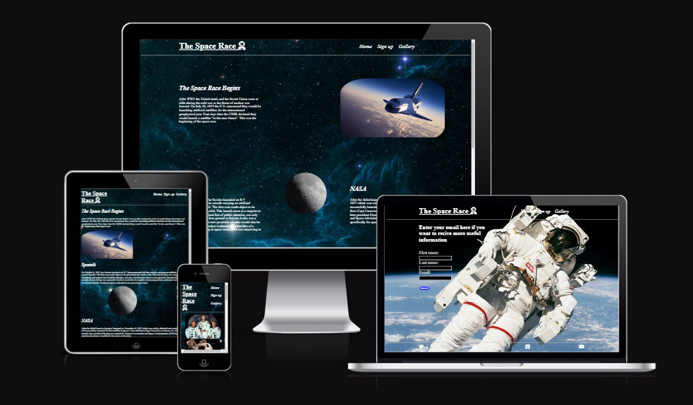
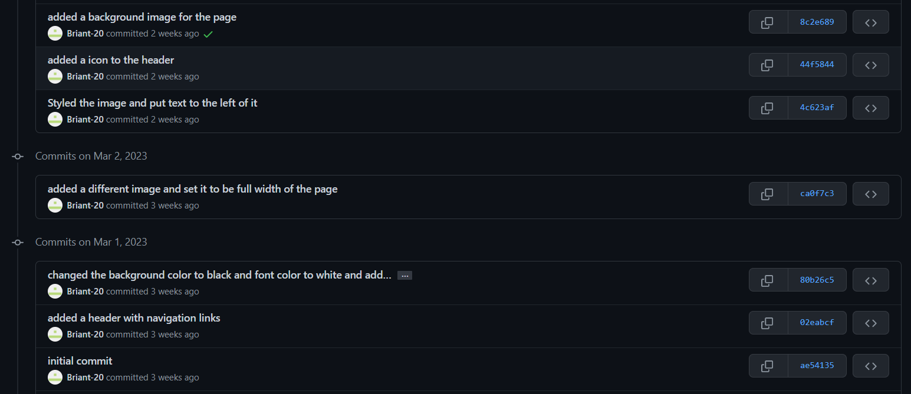

# the-space-race
The Space Race is a website designed to easily provide information about the space race between the US and the USSR beginning in 1955. Anyone who has an interest in space or history should visit the website if they want to learn more. The information on the website is condensed and concise, it provides factual information in an easy to read manner with minimal fluff.

## UX

Throughout the design of the website I wanted to make it feel consistent so I kept most of the information in the middle of the screen as I wanted it to be easily readable while also having images around it to make it less boring. I wanted there to be a clear level of progression so everything is placed so that you know what you have to read next.

### Colour Scheme

The majority of the website's background Is black as I felt it was an appropriate design choice due to the topic being space. As a result the colour of the information is white to contrast the black and make it easily readable.

### Typography

With the headers of the website I made them italic to ensure they stood out and showed their importance. I used icons from Font Awesome on the main header of the page to make it a bit more interesting and to stand out. I also used them in the footer for the links to show what clicking them would do e.g.(Clicking the youtube icon brings you to youtube) and for a link which brings you to the top of the page.

Icons source = https://fontawesome.com/

### Existing Features

I created a link which is in a fixed position in the bottom right of the screen. Clicking this link which is displayed using a icon of an up arrow which indicates its purpose, will bring the user back to the very top of the page. I feel this is a useful feature and will help users navigate the website.

The main header of the website The Space Race is a link that will bring the user back to the home page when clicked.

The nav bar contains all the links to the other parts of the webpage.

The footer contains links to external webpages such as YouTube.

The sign up page allows users to enter their name and email address.

The gallery page shows users a display of images.

The home page displays information about the space race to the user.
### Development

At the start of developing the website, i was not committing to GitHub correctly. After speaking with my mentor he explained to me what i was doing wrong and from then on i changed how i did it.

### Future Features

I would like to add a audio button that when clicked would play background music to create a more enjoyable experience for the user.

## Tools & Technologies Used

- [HTML](https://en.wikipedia.org/wiki/HTML) used to display the information and images.
- [CSS](https://en.wikipedia.org/wiki/CSS) used to style the page and change the design.
- [CSS Flexbox](https://www.w3schools.com/css/css3_flexbox.asp) used to more easily control the layout of the page.
- [Git](https://git-scm.com) used for version control. (`git add`, `git commit`, `git push`)
- [GitHub](https://github.com) used to store the code.
- [GitHub Pages](https://pages.github.com) used for hosting the site.
- [Gitpod](https://gitpod.io) used as a cloud-based IDE for development.

## Deployment

The site was deployed to GitHub Pages. The steps to deploy are as follows:
- In the [GitHub repository](https://github.com/Briant-20/the-space-race.git), navigate to the Settings tab 
- From the source section drop-down menu, select the **Main** Branch, then click "Save".
- The page will be automatically refreshed with a detailed ribbon display to indicate the successful deployment.

The live link can be found [here](https://briant-20.github.io/the-space-race)

### Local Deployment

This project can be cloned or forked in order to make a local copy on your own system.

#### Cloning

You can clone the repository by following these steps:

1. Go to the [GitHub repository](https://github.com/Briant-20/the-space-race.git) 
2. Locate the Code button above the list of files and click it 
3. Select if you prefer to clone using HTTPS, SSH, or GitHub CLI and click the copy button to copy the URL to your clipboard
4. Open Git Bash or Terminal
5. Change the current working directory to the one where you want the cloned directory
6. In your IDE Terminal, type the following command to clone my repository:
	- `git clone https://github.com/Briant-20/the-space-race.git.git`
7. Press Enter to create your local clone.

Alternatively, if using Gitpod, you can click below to create your own workspace using this repository.

Please note that in order to directly open the project in Gitpod, you need to have the browser extension installed.
A tutorial on how to do that can be found [here](https://www.gitpod.io/docs/configure/user-settings/browser-extension).

#### Forking

By forking the GitHub Repository, we make a copy of the original repository on our GitHub account to view and/or make changes without affecting the original owner's repository.
You can fork this repository by using the following steps:

1. Log in to GitHub and locate the [GitHub Repository](https://github.com/Briant-20/the-space-race.git)
2. At the top of the Repository (not top of page) just above the "Settings" Button on the menu, locate the "Fork" Button.
3. Once clicked, you should now have a copy of the original repository in your own GitHub account!

## Credits

### Content

 [Markdown Builder by Tim Nelson](https://traveltimn.github.io/markdown-builder)  README and TESTING  tool to help generate the Markdown files

[W3schools](https://www.w3schools.com/)  help regarding coding problems.

[Stackoverflow](https://stackoverflow.com/)  help regarding coding problems

### Media

- [assets/images/45degree-astronaut.jpg](https://www.nationalgeographic.com/science/article/first-untethered-spacewalk-bruce-mccandless-astronaut-space-science)
- [assets/images/space-shuttle.jpg](https://www.apqc.org/blog/remembering-apollo-why-km-mission-critical-nasa) 
- [assets/images/apollo8.jpg](https://www.smithsonianmag.com/smithsonian-institution/how-apollo-8-saved-1968-180970991/)
- [assets/images/apollo11.jpg](https://www.britannica.com/topic/Apollo-11)
- [assets/images/apollomoon.jpg](https://www.bbc.com/news/uk-wales-49036048)
- [assets/images/astronaut.jpg](https://www.pexels.com/search/astronaut/)
- [assets/images/background.jpg](https://www.pxfuel.com/en/desktop-wallpaper-osbsy)
- [assets/images/launch.jpg](https://www.popularmechanics.com/space/rockets/a36304153/nasa-space-shuttle/)
- [assets/images/webb.jpeg](https://www.nasa.gov/webbfirstimages)
- [assets/images/webb2.jpg](https://www.sciencenews.org/article/favorite-top-space-images-of-all-time)
- [assets/images/moon.jpg](https://www.eso.org/public/belgium-nl/videos/moon_big_4k/)
- [assets/images/moon-landing.jpg](https://www.jpl.nasa.gov/edu/news/2019/5/29/celebrate-the-50th-anniversary-of-nasas-apollo-moon-landing-with-educational-resources-and-projects-for-kids/)
- [assets/images/satellite.jpg](https://www.flickr.com/photos/gsfc/12867973205)
- [assets/images/shuttle.png](https://www.nasa.gov/feature/60-years-ago-soviets-launch-sputnik-3)
- [assets/images/space-img.jpeg](https://cordis.europa.eu/article/id/413499-cost-effective-green-and-more-efficient-propulsion-systems-for-small-satellites)
- [assets/images/vostok-rocket.jpg](https://www.space.com/every-crewed-spacecraft-human-spaceflight-history.html)
- [assets/images/yuri.jpg](https://wallpapersafari.com/yuri-gagarin-wallpaper/)

### Acknowledgements

- I would like to thank my Code Institute mentor, Tim Nelson for their support throughout the development of this project.
- I would like to thank the [Code Institute](https://codeinstitute.net) tutor team for their assistance with troubleshooting and debugging some project issues.
- I would like to thank the [Code Institute Slack community](https://code-institute-room.slack.com) for the moral support; it kept me going during periods of self doubt and imposter syndrome.

