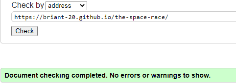
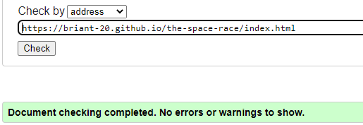
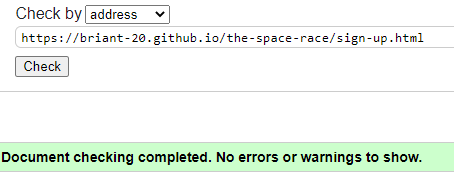
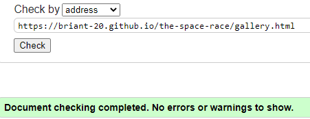
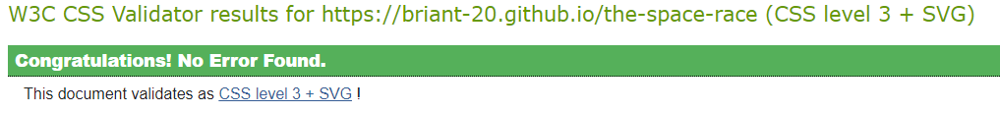
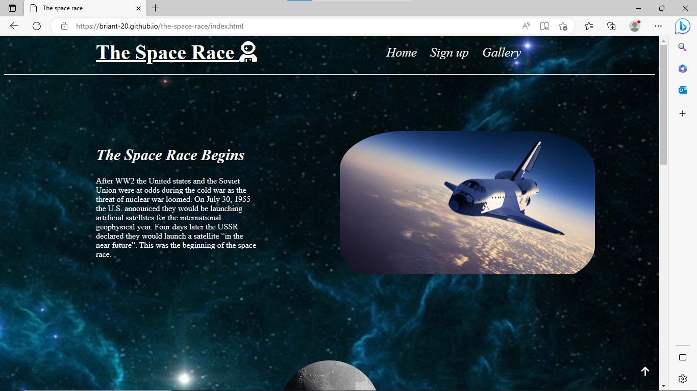
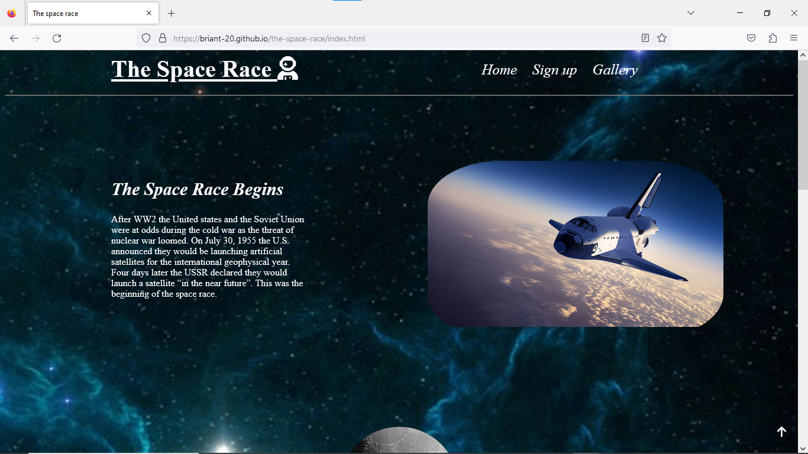
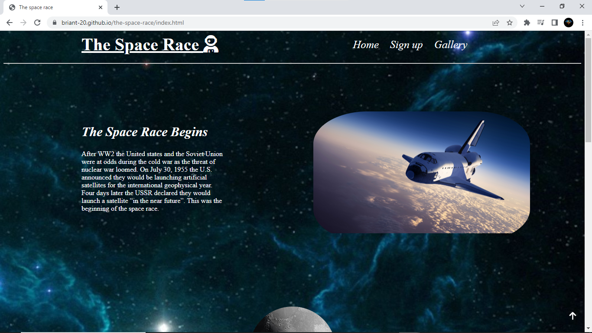
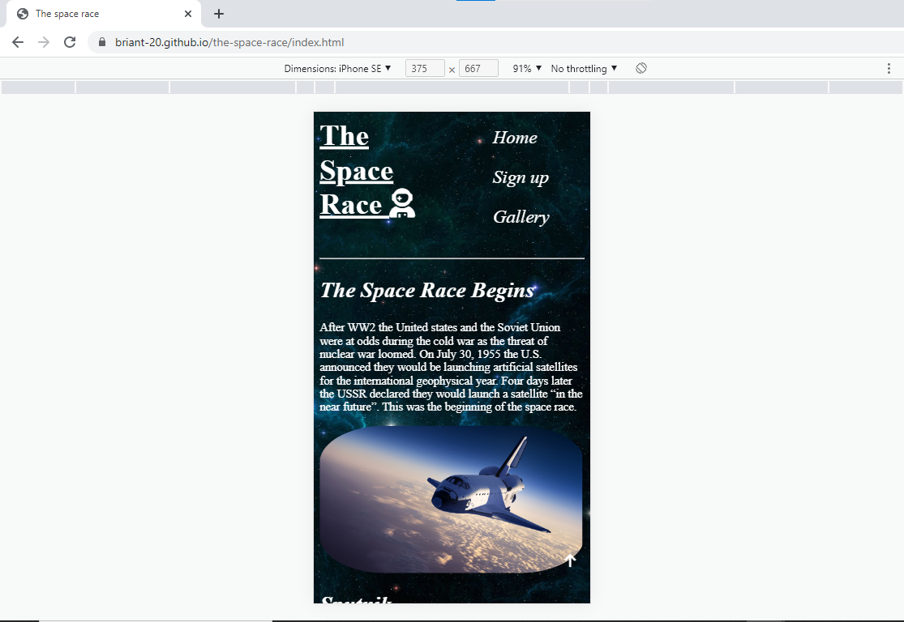
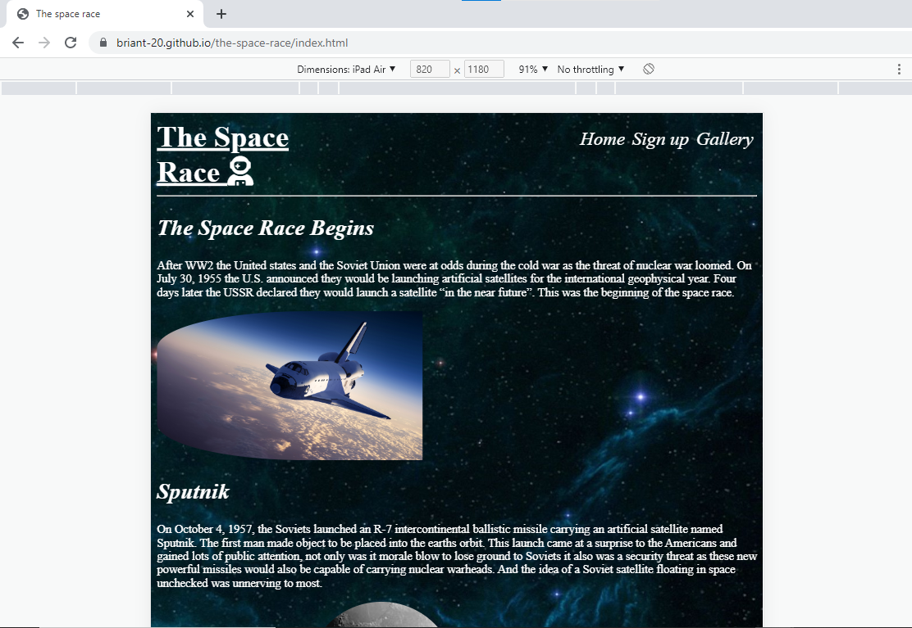

# Testing

## Code Validation

### HTML

I have used the recommended [HTML W3C Validator](https://validator.w3.org) to validate all of my HTML files.

- [index.html validated](https://validator.w3.org/nu/?doc=https%3A%2F%2Fbriant-20.github.io%2Fthe-space-race%2Findex.html)
- [sign-up.html validated](https://validator.w3.org/nu/?doc=https%3A%2F%2Fbriant-20.github.io%2Fthe-space-race%2Fsign-up.html)
- [gallery.html validated](https://validator.w3.org/nu/?doc=https%3A%2F%2Fbriant-20.github.io%2Fthe-space-race%2Fgallery.html)

### CSS

I have used the recommended [CSS Jigsaw Validator](https://jigsaw.w3.org/css-validator) to validate all of my CSS files.

- [CSS validated](http://jigsaw.w3.org/css-validator/validator?lang=en&profile=css3svg&uri=https%3A%2F%2Fbriant-20.github.io%2Fthe-space-race&usermedium=all&vextwarning=&warning=1)

## Browser Compatibility

I've tested my deployed project on multiple browsers to check for compatibility issues.

Chrome

Edge

Firefox

## Responsiveness

Desktop

Mobile

Tablet

